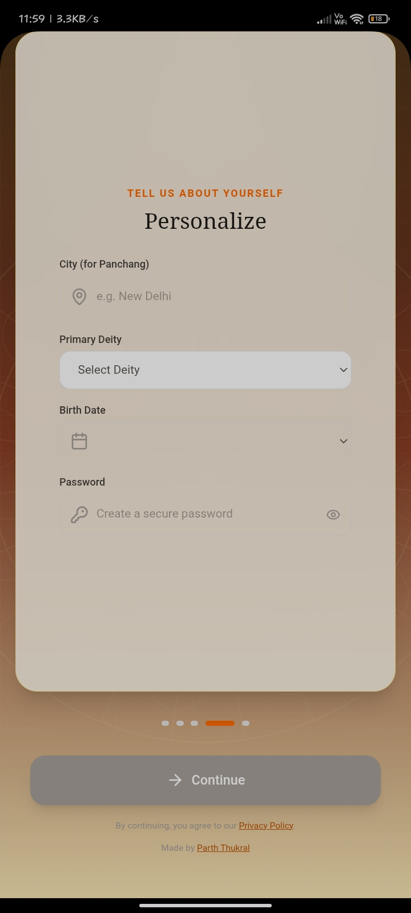
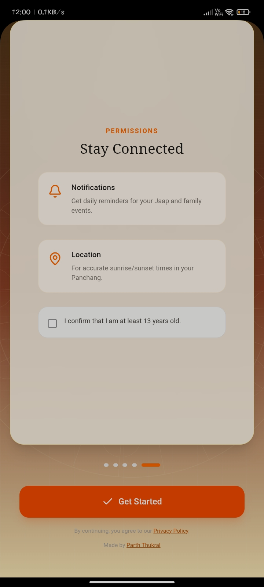
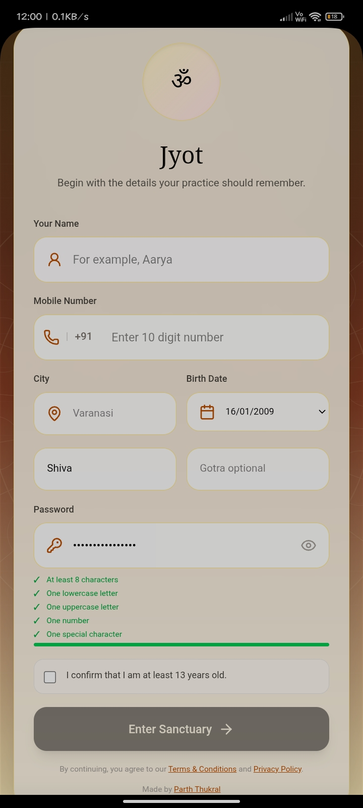
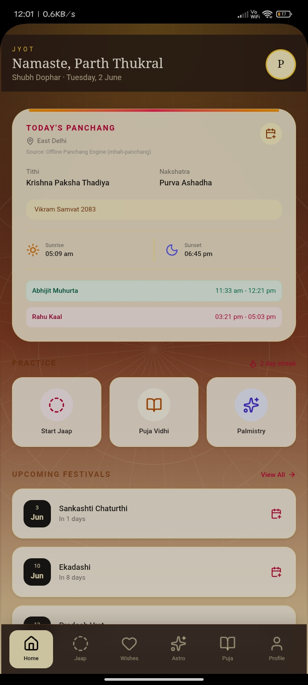
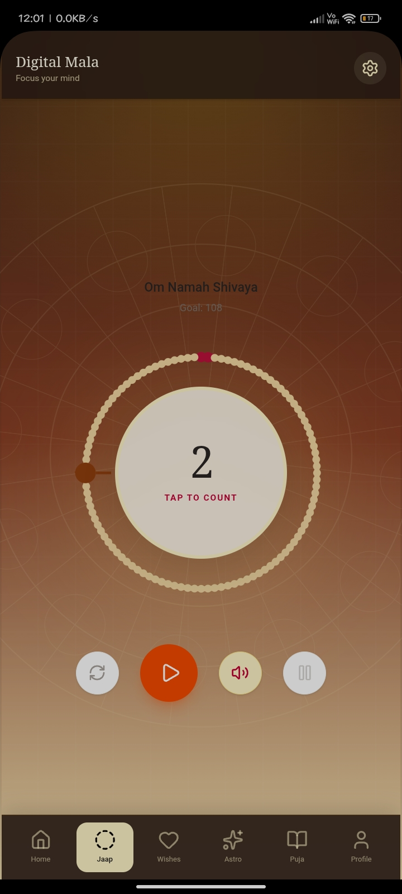
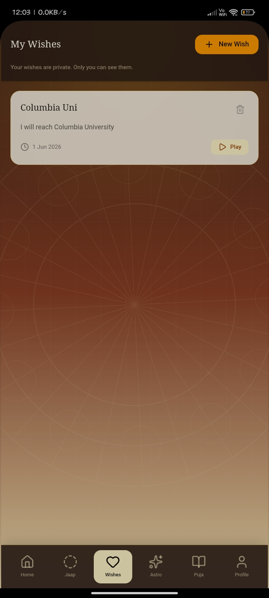
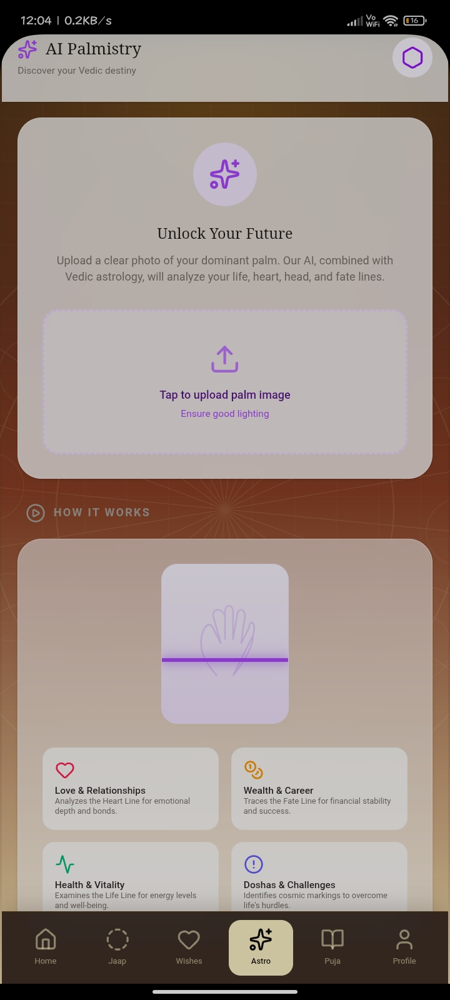
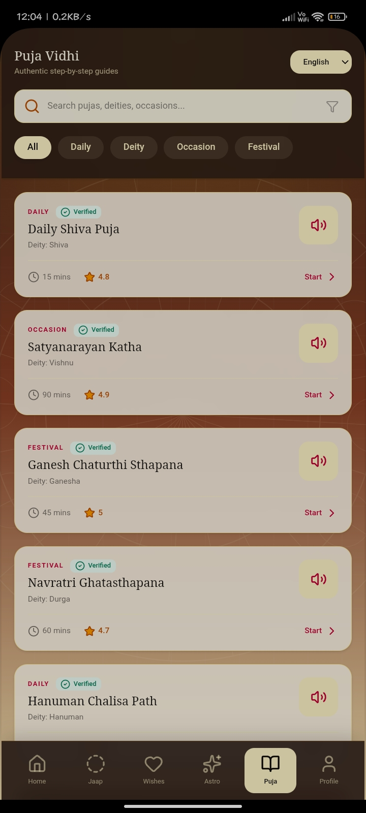
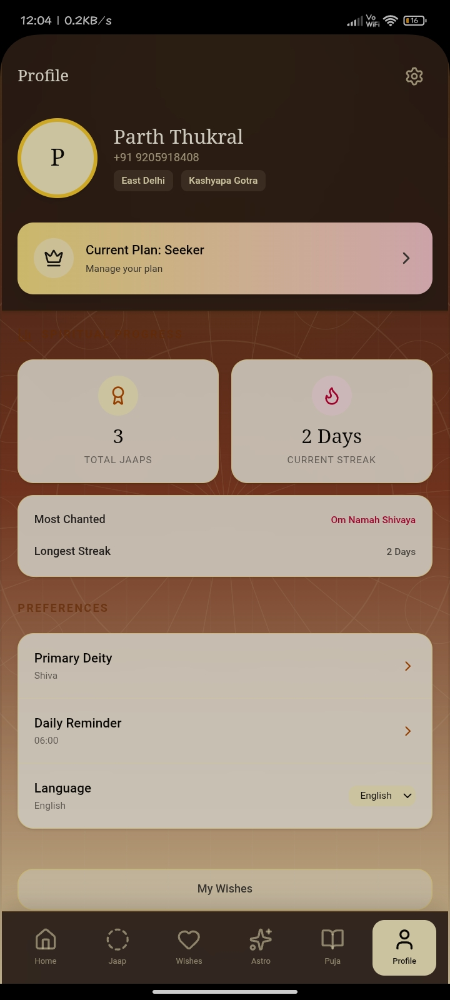

<div align="center">
  
  <h1 align="center">Jyot</h1>
  <p align="center">A full-stack spiritual companion app for daily practice, Vedic almanac, AI palm reading, and digital jaap tracking.</p>
  <p align="center">
    <a href="#features">Features</a> •
    <a href="#live-demo">Live Demo</a> •
    <a href="#tech-stack">Tech Stack</a> •
    <a href="#getting-started">Getting Started</a> •
    <a href="#deployment">Deployment</a> •
    <a href="#android-app">Android App</a>
  </p>
</div>

> ⚠️ Jyot is currently an experimental open-source project under active development. Some features, especially AI-powered palm reading and Android builds, may evolve rapidly or occasionally behave inconsistently.

---

## Live Demo

- **Web App**: [https://myjyot.xyz](https://myjyot.xyz)
- **Android APK**: [GitHub Releases](https://github.com/Developer-Parth/Jyot/releases)

---

## Features

### Screenshots

<p align="center">
  
  
  
  
  
</p>

<p align="center">
  
  
  
</p>

<p align="center">
  
  
  
  
  
</p>

<p align="center">
  
  
  
</p>

### Panchang (Vedic Almanac)
Daily panchang computed entirely offline using the `mhah-panchang` library — no paid API required. Calculates:
- Tithi, Paksha, Nakshatra, Samvat
- Sunrise/Sunset, Brahma Muhurta, Abhijit Muhurta
- Rahu Kaal and upcoming festivals (scanning 120 days ahead)
- Supports 15 Indian cities with English/Hindi output

### AI Palm Reading
Upload a palm photo and receive a detailed reading via Google Gemini 2.5 Flash. The system includes robust retry and fallback handling for improved reliability during temporary API failures or rate limits.

### Digital Jaap Mala
A full interactive mala counter with:
- 108-bead SVG visualization with progress ring
- Preset mantras and customizable goals
- Tap-to-count with haptic feedback
- Autoplay mode and voice chant playback (Web Speech API + native Android TTS)
- Persistent progress per mantra with completed-session tracking

### Puja Library
A searchable collection of pujas with:
- English and Hindi content
- Step-by-step vidhi with countdown timers
- Samagri checklist (persisted locally)
- Amazon search links for each item
- Chant playback

### Subscription Plans
| Plan | Monthly | Features |
|------|---------|----------|
| Seeker | ₹0 | Basic jaap, streaks, daily almanac |
| Devotee | ₹101 | Full history, ad-free, all puja vidhis |
| Sadhak | ₹251 | Unlimited AI palmistry, custom reminders |
| Guru Dakshina | ₹501 | Coming soon |

### Streak Tracking
Tracks daily activity streaks (current + longest) tied to login and jaap activity.

---

## Tech Stack

| Layer | Technology |
|---|---|
| Frontend | React 19, Vite 6, TypeScript, Tailwind CSS v4 |
| UI | Motion (animations), Lucide React (icons), react-markdown |
| Routing | react-router-dom v7 |
| Backend | Node.js, Express 4 |
| Data | JSON file storage with in-memory cache and atomic writes |
| AI | Google GenAI SDK (Gemini 2.5 Flash) |
| Panchang | mhah-panchang (offline, no API key needed) |
| Mobile | Capacitor (Android native wrapper) |
| Deployment | Vercel (serverless function + static SPA) |

---

## Security

- Gemini API keys are stored securely in backend environment variables only.
- No API keys are exposed to the frontend, APK, or browser bundle.
- The frontend communicates only with backend `/api/*` routes.
- Sensitive credentials should never be committed to GitHub.

---

## Getting Started

### Prerequisites
- Node.js 18+
- npm

### Setup

1. Clone the repository:
   ```bash
   git clone https://github.com/Developer-Parth/Jyot.git
   cd Jyot
   ```

2. Install dependencies:
   ```bash
   npm install
   ```

3. Create environment file:
   ```bash
   cp .env.example .env
   ```
   Add your Gemini API keys to `.env`. The system uses the primary key first with automatic fallback through backup keys if needed.

4. Start the development server:
   ```bash
   npm run dev
   ```
   Open `http://localhost:3003`. The backend runs on port `3003` with Vite dev middleware for HMR.

### Scripts

| Script | Description |
|---|---|
| `npm run dev` | Start dev server (Express + Vite HMR) |
| `npm run build` | Build frontend (Vite) + bundle backend (esbuild) |
| `npm run start` | Start production server from `dist/server.cjs` |
| `npm run lint` | Run TypeScript type checking (`tsc --noEmit`) |
| `npm run clean` | Remove `dist/` directory |

---

## API

All routes are mounted under `/api`:

| Method | Path | Description |
|---|---|---|
| `GET` | `/api/health` | Health check |
| `GET` | `/api/ping` | Liveness check with timestamp |
| `POST` | `/api/auth/login` | Profile-based login/signup |
| `GET` | `/api/users/:id` | User profile + analytics + subscription |
| `PUT` | `/api/users/:id` | Update user profile |
| `GET` | `/api/jaap/:userId` | Get latest jaap session |
| `PUT` | `/api/jaap/:userId` | Save or update jaap progress |
| `POST` | `/api/palm-reading` | Submit palm image for AI reading |
| `GET` | `/api/panchang` | Get daily panchang (query: `city`, `lang`) |
| `POST` | `/api/subscriptions` | Create subscription with billing details |

---

## Architecture

```
                    ┌─────────────────────────┐
                    │   Vercel Serverless      │
                    │   Function (api/index.ts) │
                    │                          │
                    │   Express App            │
                    │   ├── /api/ping          │
                    │   ├── /api/health        │
                    │   ├── /api/auth/*        │
                    │   ├── /api/users/*       │
                    │   ├── /api/jaap/*        │
                    │   ├── /api/palm-reading  │
                    │   ├── /api/panchang      │
                    │   └── /api/subscriptions │
                    │                          │
                    │   JSON Store             │
                    │   (users, jaaps,         │
                    │    subscriptions,        │
                    │    palm_readings)        │
                    └──────────┬──────────────┘
                               │
                    ┌──────────┴──────────────┐
                    │   Static SPA (dist/)     │
                    │   React 19 + Vite        │
                    └─────────────────────────┘
```

### Data Storage
The app uses **JSON file storage** with an in-memory cache and atomic writes (`.tmp` → rename). No database setup is needed. Collections are auto-created on first access.

- **Local**: `server/data/`
- **Vercel**: `/tmp/data` (ephemeral per instance)

> JSON file storage works well for single-user or low-traffic use. For production at scale, consider migrating to SQLite or a managed database.

### Gemini API Key Handling
The AI palm reader loads keys from environment variables (`GEMINI_API_KEY`, `GEMINI_API_KEY_1` … `GEMINI_API_KEY_10`, `GEMINI_API_KEYS`). If a request fails due to rate limits or temporary errors, it retries with the next available key. Keys are never exposed to the client.

---

## Deployment

### Vercel

The project is Vercel-ready:

1. Connect your GitHub repository to Vercel.
2. Set the following environment variables in Vercel dashboard:
   - `GEMINI_API_KEY` through `GEMINI_API_KEY_10`
   - `GEMINI_API_KEYS`
3. Deploy. The `vercel.json` configures:
   - API routes via `api/index.ts` (serverless function)
   - Static SPA fallback for client-side routing

### Environment Variables

| Variable | Required | Description |
|---|---|---|
| `GEMINI_API_KEY` | Yes | Primary Gemini API key |
| `GEMINI_API_KEY_1–10` | No | Backup keys for fallback |
| `GEMINI_API_KEYS` | No | Comma-separated additional keys |
| `PORT` | No | Server port (default: `3003`) |

---

## Android App

Build the Capacitor Android APK:

```bash
npm run build
npx cap sync android
```

Then build the APK from Android Studio or via CLI:

```bash
cd android
./gradlew assembleDebug
```

The APK will be at `android/app/build/outputs/apk/debug/`. The `android/app/build/` directory is gitignored.

---

## Project Structure

```
Jyot/
├── api/                   # Express backend
│   ├── app.ts            # App creation (sync for Vercel, async for dev)
│   ├── index.ts          # Vercel serverless entry point
│   ├── routes.ts         # All API route handlers
│   ├── storage.ts        # JSON file store with atomic writes
│   ├── controllers/      # Route controllers
│   ├── models/           # Data models
│   └── services/         # Gemini AI, Panchang engine
├── src/                   # React frontend
│   ├── App.tsx           # Root component with auth-gated routing
│   ├── pages/            # Home, Login, Jaap, PalmReading, Puja, Profile, Subscription
│   ├── components/       # Layout, LiveBackground
│   ├── hooks/            # usePalmReading
│   ├── services/         # API client
│   ├── lib/              # Sound, branding, utils
│   └── data/             # Puja library, i18n
├── android/               # Capacitor Android native project
├── server.ts              # Local dev entry point
├── vite.config.ts         # Vite + React + Tailwind config
├── vercel.json            # Vercel deployment config
└── capacitor.config.ts    # Capacitor config
```

---

## License

[MIT](LICENSE)

---

## Contributing

See [CONTRIBUTING.md](CONTRIBUTING.md). All contributions are welcome.
